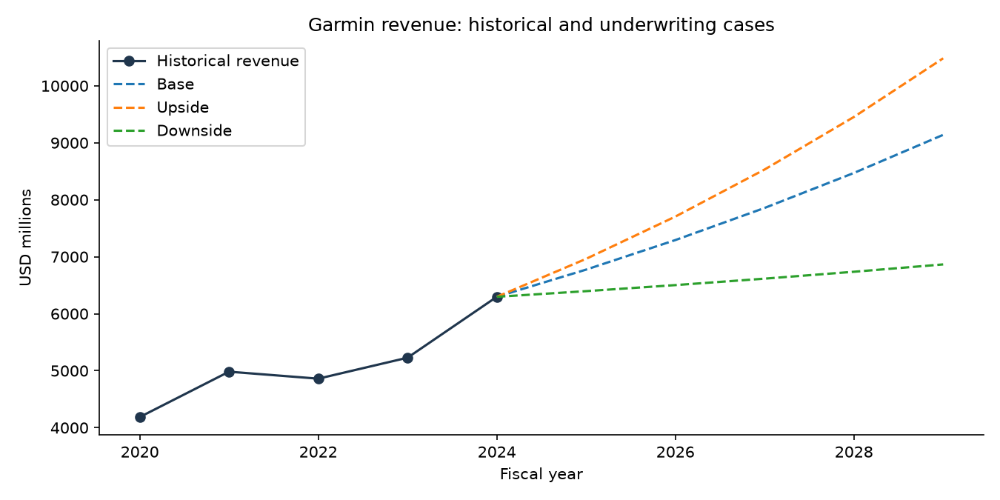
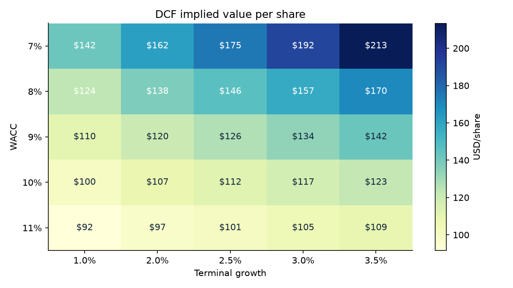
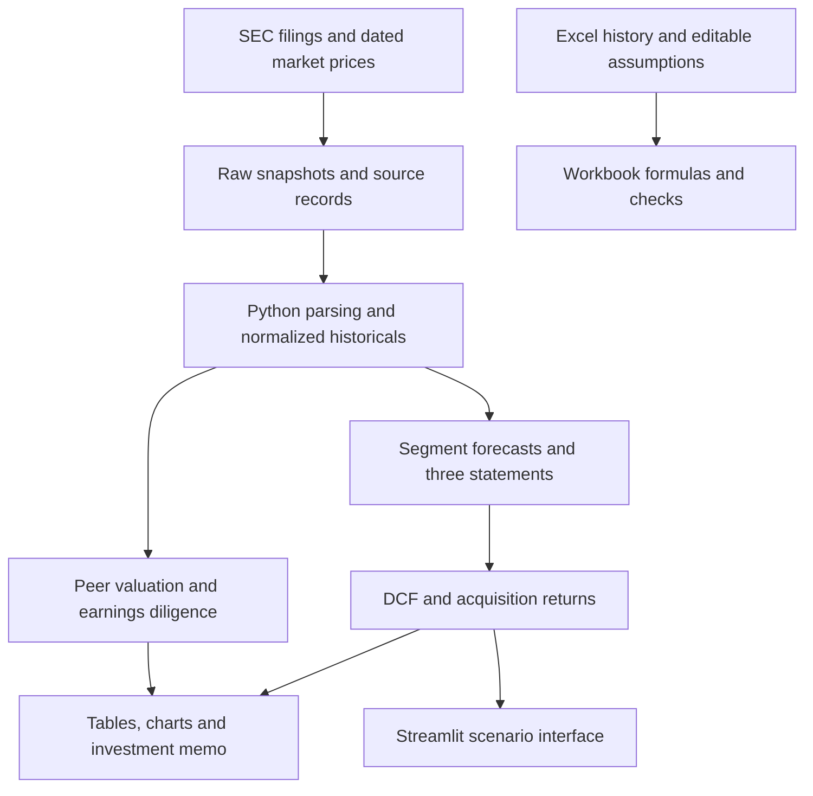

# Garmin Acquisition Underwriting Engine

I built this project to assess a hypothetical acquisition of Garmin using public filings and dated market data. It connects historical financials to operating forecasts, valuation, acquisition financing and sponsor returns in Python and Excel.

**Investment question:** At what price and capital structure would acquiring Garmin meet a 20% sponsor return hurdle?

**Conclusion:** Do not proceed at the assumed **15.0x EBITDA / $26.48bn entry EV**. Base IRR is **10.5%**, downside IRR is **−8.3%**, and the maximum base-case entry EV at a 20% hurdle is **$19.16bn / 10.9x EBITDA**.

This is a historical analytical case using information available on **February 28, 2025**, not a current investment recommendation. Forecasts and acquisition returns are hypothetical.

| Five-year case | DCF EV | Sponsor IRR | MOIC | Maximum EV at 20% IRR |
|---|---:|---:|---:|---:|
| Base | $20.82bn | 10.5% | 1.65x | $19.16bn |
| Upside | $25.17bn | 18.8% | 2.37x | $25.42bn |
| Downside | $13.69bn | −8.3% | 0.65x | $10.43bn |

[Investment memo](reports/investment_memo.md) · [Excel model](models/acquisition_model.xlsx) · [Scenario results](outputs/tables/scenarios.csv)

## Visual preview

These charts are generated by the Python model from the saved case inputs.





## What I built

- **Financial modeling:** five-segment forecasts, integrated statements, FCFF DCF, historical peer comparisons, a public-information QoE bridge, LBO returns and target-return purchase-price solving.
- **Data work:** SEC Company Facts ingestion, custom inline-XBRL extraction, historical prices, normalized financial tables and source tracking.
- **Implementation:** modular Python calculations, a 16-sheet Excel review model, a Streamlit scenario interface, automated reports and tests.

## How the model works



The Excel workbook implements the calculations separately. Running Python rebuilds the tables, charts, JSON and memo; it does **not** update Excel. See [model usage](docs/usage.md) for workbook controls and input alignment.

## Data sources

- **Financial statements:** SEC Company Facts and Garmin's [FY2024 10-K](https://www.sec.gov/Archives/edgar/data/1121788/000095017025022760/grmn-20241228.htm) and [FY2022 10-K](https://www.sec.gov/Archives/edgar/data/1121788/000095017023003566/grmn-20221231.htm).
- **Segments:** Garmin's [FY2024 earnings release](https://www.garmin.com/en-US/newsroom/wp-content/uploads/2025/02/2024-Q4-GRMN-Earnings-Release_Final.pdf).
- **Peers and prices:** Logitech and Polaris annual filings, plus Yahoo daily closes for February 28, 2025. Peer multiples use their stated historical fiscal years, not aligned LTM results.

Raw SEC HTML is retained for custom inline-XBRL disclosures. [Data provenance](data/README.md) explains source records, extraction and refresh; the [data dictionary](docs/data_dictionary.md) defines fields and units.

## Run locally

Run from the repository root. The recorded clean-environment validation used Python 3.13. Committed snapshots allow offline analysis after installing dependencies.

```powershell
python -m venv .venv
.\.venv\Scripts\python.exe -m pip install -r requirements.lock.txt
.\.venv\Scripts\python.exe -m src.pipeline
.\.venv\Scripts\python.exe -m pytest -q
.\.venv\Scripts\python.exe -m streamlit run dashboard/app.py
```

On macOS/Linux, use `.venv/bin/python` instead of `.\.venv\Scripts\python.exe`. Streamlit serves the local interface on port 8501. Open the committed Excel workbook directly; no macros are required. [Usage details](docs/usage.md) cover controls, refresh and adapting the target.

## Key assumptions and limitations

Base assumptions include a 28% EBITDA margin, CapEx at 3.5% of sales, 21% tax, 3x entry leverage, 7.5% acquisition interest and a 14x exit multiple. No unsupported QoE addbacks are applied.

The peer set is small, terminal assumptions materially affect value, and the hypothetical entry EV is already below the saved public-market EV. The model omits purchase accounting, detailed tax rules, synergies, exit fees and lender covenants. Additional borrowing is a funding need, not a commitment. See [methodology and limitations](docs/methodology.md), including the known historical SG&A classification gap.

## Validation

Automated tests cover statement reconciliation, valuation bridges, debt and sponsor returns, scenarios and key error cases. Recorded workbook checks compare the three cases with Python. Native Excel UI verification was unavailable. See the [validation record](docs/validation.md) for scope and results.

## Repository structure

```text
config/          Company, segment and scenario inputs
src/             Financial calculations and reporting
scripts/         Source downloads, XBRL extraction and validation utilities
data/raw/        Original disclosures, prices and source metadata
data/processed/  Normalized history and provenance
models/          Formula-driven Excel workbook
dashboard/       Streamlit interface
notebooks/       Three executable review notebooks
outputs/         Charts, CSV schedules, model JSON and workbook checks
reports/         Generated investment memo
docs/            Usage, methodology, data dictionary and validation
tests/           Financial, application and artifact tests
```

## Tech stack

Python, pandas, NumPy, PyYAML, Beautiful Soup, Matplotlib, Streamlit, pytest, Excel and GitHub Actions. Jupyter notebooks provide optional review views; there is no machine-learning layer.
