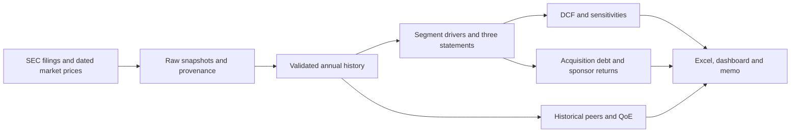

# Garmin Acquisition Underwriting Engine

An end-to-end acquisition underwriting and financial due-diligence engine that converts public financial data into an integrated operating forecast, DCF valuation, QoE analysis, LBO returns model, and scenario-based investment recommendation.

**Investment question:** At what price and capital structure would acquiring Garmin meet a 20% sponsor return hurdle?

**Conclusion:** Do not proceed at the assumed **15.0x EBITDA / $26.48bn entry EV**. Base IRR is **10.5%**, downside IRR **−8.3%**, and the base-case maximum entry EV at a 20% hurdle is **$19.16bn / 10.9x EBITDA**. This is a historical case using information available on **February 28, 2025**, not a current recommendation.

| Five-year case | DCF EV | Sponsor IRR | MOIC | Maximum EV at 20% IRR |
|---|---:|---:|---:|---:|
| Base | $20.82bn | 10.5% | 1.65x | $19.16bn |
| Upside | $25.17bn | 18.8% | 2.37x | $25.42bn |
| Downside | $13.69bn | −8.3% | 0.65x | $10.43bn |

## Open the project

- [Investment memo](reports/investment_memo.md): recommendation, valuation, risks and diligence questions.
- [Excel acquisition model](models/acquisition_model.xlsx): 16 sheets, editable annual drivers, three scenarios, live DCF/LBO formulas, heatmaps and reconciliation checks.
- [Scenario comparison](outputs/tables/scenarios.csv) and [historical statements](data/processed/historicals.csv).
- [Methodology and assumptions](docs/methodology.md), [data provenance](data/README.md), [data dictionary](docs/data_dictionary.md).


## What this demonstrates

Segment-based revenue forecasting; integrated income, balance-sheet and cash-flow statements; working-capital days; PP&E and debt roll-forwards; nominal USD FCFF DCF; historical peer multiples; supported QoE adjustments; cash-free/debt-free acquisition sources and uses; debt sweeps; IRR/MOIC; numerical purchase-price solving. Python automates the analysis while Excel exposes the mechanics for review. There is no machine-learning layer.



## Run from a clean Python environment

Python 3.11–3.13 is supported; development and clean-environment validation used Python 3.13. All primary data snapshots are committed, so the model runs without network access after dependencies are installed.

```powershell
python -m venv .venv
.\.venv\Scripts\python.exe -m pip install -r requirements.lock.txt
.\.venv\Scripts\python.exe -m src.pipeline
.\.venv\Scripts\python.exe -m pytest -q
.\.venv\Scripts\python.exe -m streamlit run dashboard/app.py
```

On macOS/Linux, use `.venv/bin/python` in place of `.\.venv\Scripts\python.exe`. The lock file records the tested dependency versions; requirements.txt contains the supported version ranges. Run commands from the repository root. The pipeline regenerates CSV tables, charts, `outputs/model.json` and the memo. Streamlit opens the scenario interface on localhost port 8501. All entry-price, growth, EBITDA-margin, discount-rate, leverage, interest, exit-multiple and holding-period controls rerun calculations.

### Excel model

Open the committed workbook in Excel without macros. In **Assumptions D6**, select `1` (base), `2` (upside) or `3` (downside). Each driver has separate editable annual inputs for all three cases. **LBO D6** controls entry EV; **DCF D28** switches terminal methods. Use Excel Goal Seek to set LBO D45 to the target IRR by changing D6. The Python solver is available through `src.lbo.maximum_entry_ev` and the dashboard.

The included workbook recalculates directly in Excel. Change its assumptions in the workbook to explore different cases. Running the Python pipeline regenerates the CSV tables, charts, model JSON and memo; it does not update the Excel file. Keep the workbook inputs aligned with the Python configuration when comparing results.

Workbook calculations were compared with Python outputs, and rendered previews and saved-file structure were checked. Native Microsoft Excel visual verification was unavailable. See the [validation record](docs/validation.md) for details.

### Sources and refresh

- [Garmin FY2024 10-K](https://www.sec.gov/Archives/edgar/data/1121788/000095017025022760/grmn-20241228.htm), FY2022 10-K and SEC companyfacts for FY2020–FY2024.
- [Garmin segment results](https://www.garmin.com/en-US/newsroom/wp-content/uploads/2025/02/2024-Q4-GRMN-Earnings-Release_Final.pdf).
- SEC annual filings for Logitech and Polaris; individual fiscal dates remain visible. These are **historical annual reference multiples**, not LTM or forward comparables.
- Yahoo daily chart responses for the February 28, 2025 unadjusted closes. Fiscal-end shares approximate market-date shares.

To download fresh snapshots, set `SEC_USER_AGENT` to a real identifying research contact, then run `python scripts/download_data.py --refresh` and `python scripts/extract_custom_facts.py`. The selection cutoff stays fixed until changed in configuration. SEC/network failures raise an error; they never generate substitute numbers. Preserve existing snapshots when reproducing the published case. The manual import path is documented in [data/README.md](data/README.md).

### Replace the target

The financial engines accept normalized history and assumptions. Update `config/company.yaml` (name, ticker, currency, period, segments and peers) and `config/assumptions.yaml`, supply the new target's normalized CSV and adjacent provenance ledger, and run `python -m src.pipeline --manual path/to/historicals.csv`. Provide raw SEC and market snapshots for share counts and peers. Automatic historical tag mapping and zero-debt policy deliberately apply only to Garmin; another company's missing debt must never silently become zero. The Excel layout is the five-segment Garmin case; adapt its segment labels/rows if a replacement target needs a different layout. The core Python forecast accepts any number of operating segments.

## Validation

Unit and integration tests cover historical reconciliation, period cutoffs, custom cash flows, DCF PV/terminal/equity bridges, sensitivity directionality, sources and uses, debt sweeps and liquidity shortfalls, cash/equity/PP&E roll-forwards, IRR/MOIC, numerical target-return solving, scenario ordering, invalid inputs and dashboard interactions. Excel checks compare the three cases with Python and test a later-period driver edit. See [validation record](docs/validation.md).

## Assumptions and limits

Forecasts are prospective analyst judgments: base EBITDA margin 28%, CapEx 3.5% of sales, 21% tax rate, 3x entry leverage, 7.5% interest and 14x exit EBITDA. No unsupported QoE addbacks are made. See the full [methodology](docs/methodology.md) for sources/uses cash treatment, lease convention, opening-debt interest, balance-sheet residual accounts, SBC, D&A allocation and terminal-value dependence.

The peer set is small and has different business mixes and fiscal ends. The model does not include synergies, purchase accounting, detailed deferred taxes, NOLs, tax leakage, exit fees or lender covenants. Additional borrowing is a disclosed funding requirement, not a commitment. Cash balances and terminal multiples materially affect results. The 2025-02-28 case date is approximated using the latest fiscal opening balance sheet and annual year-end discounting.

## Repository

```text
config/       Company, segments, scenarios and underwriting assumptions
src/          Data, financials, valuation, diligence, LBO and reporting modules
scripts/      Public-source refresh, custom XBRL extraction and validation utilities
 data/raw/    Original source snapshots, metadata and SHA256 manifest
 data/processed/ Validated history and field-level source ledgers
models/       Formula-driven acquisition_model.xlsx
 dashboard/   Streamlit interface
notebooks/    Thin, executable review views over the production modules
reports/      Generated investment memo
outputs/      Charts, CSV schedules, model JSON and workbook validation
 tests/       Financial, integration and interface tests
 docs/        Methodology, data dictionary and validation record
PLAN.md       Phased implementation checklist
```

Tech stack: Python, pandas, NumPy, Matplotlib, PyYAML, Streamlit, pytest and Excel. Optional Jupyter notebooks provide a guided review; the core workflow does not require Jupyter, VBA or an API key.
